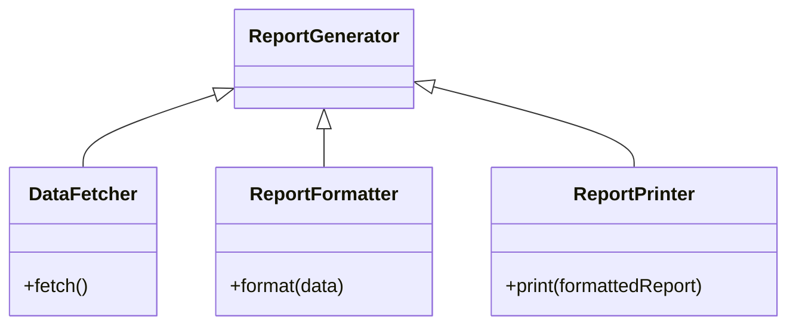
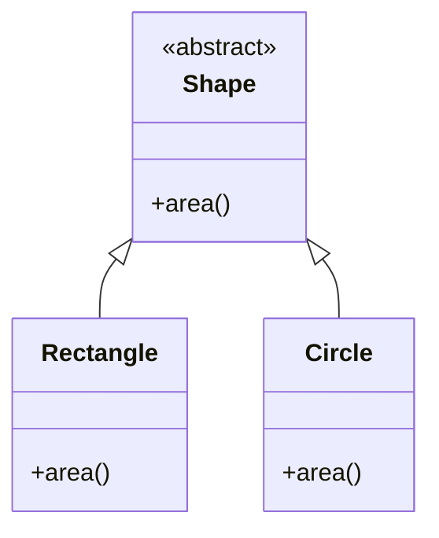
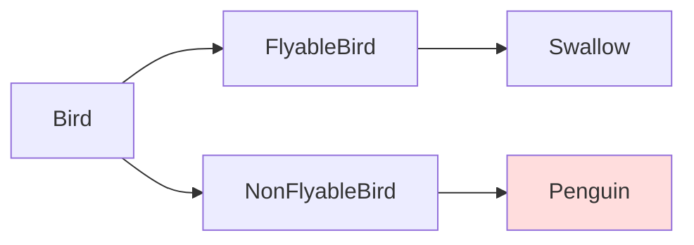
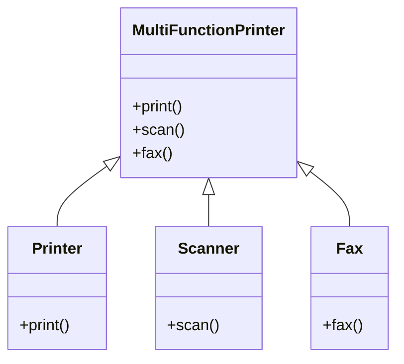
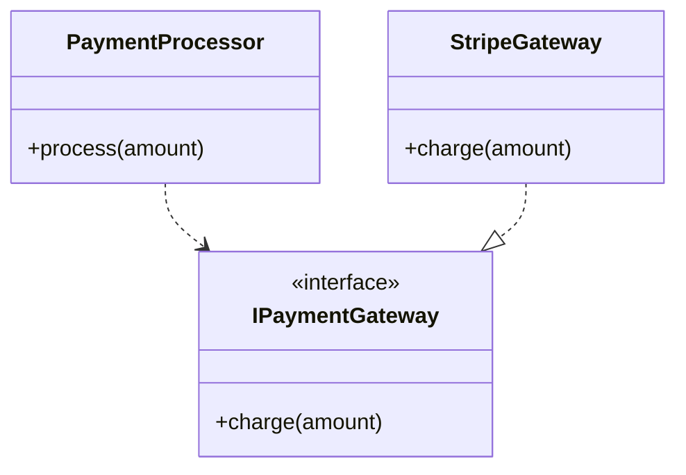

# SOLID Principles — Example Code & Explanations

A concise, professional guide to the SOLID object-oriented design principles with clear definitions, short examples, and diagrams to help you understand and apply each principle in your code.

This repository contains example implementations that demonstrate each SOLID principle. The README below defines each principle, explains why it matters, and provides a compact diagram and sample code to illustrate the recommended structure.

---

## Table of Contents
- [Project Overview](#project-overview)
- [Why SOLID?](#why-solid)
- [Principles — Definitions, Diagrams & Examples](#principles----definitions-diagrams--examples)
  - [S — Single Responsibility Principle (SRP)](#s---single-responsibility-principle-srp)
  - [O — Open/Closed Principle (OCP)](#o---openclosed-principle-ocp)
  - [L — Liskov Substitution Principle (LSP)](#l---liskov-substitution-principle-lsp)
  - [I — Interface Segregation Principle (ISP)](#i---interface-segregation-principle-isp)
  - [D — Dependency Inversion Principle (DIP)](#d---dependency-inversion-principle-dip)
- [Repository Structure](#repository-structure)
- [How to run / use the examples](#how-to-run--use-the-examples)
- [Contributing](#contributing)
- [License](#license)

---

## Project Overview
This repo demonstrates the SOLID principles through small, focused examples (language-agnostic structure; examples use short pseudocode / TypeScript-style snippets). Each example highlights a common anti-pattern and the improved design that follows the principle.

---

## Why SOLID?
SOLID is an acronym representing five principles intended to improve software modularity, readability, maintainability, and extensibility. Following these principles helps reduce coupling, improve testability, and make systems easier to evolve.

---

## Principles — Definitions, Diagrams & Examples

### S — Single Responsibility Principle (SRP)
Definition:
- A class/module should have one, and only one, reason to change. In other words, it should have a single responsibility.

Why it matters:
- Separates concerns so changes in one responsibility don't force changes in unrelated code.

Diagram (Mermaid class diagram):


Example (pseudo/TypeScript):
```ts
// Bad: single class doing fetching, formatting and printing
class ReportGenerator {
  fetchData() { /* ... */ }
  formatReport(data) { /* ... */ }
  print(report) { /* ... */ }
}

// Good: separate responsibilities
class DataFetcher { fetchData() { /* ... */ } }
class ReportFormatter { format(data) { /* ... */ } }
class ReportPrinter { print(formattedReport) { /* ... */ } }
```

---

### O — Open/Closed Principle (OCP)
Definition:
- Software entities (classes, modules, functions) should be open for extension but closed for modification.

Why it matters:
- Allows adding new behavior without altering existing tested code, reducing regression risk.

Diagram (Mermaid class diagram):


Example:
```ts
// OCP-friendly: new shapes can be added without modifying existing logic
abstract class Shape { abstract area(): number }

class Rectangle extends Shape { area() { /* rect area */ } }
class Circle extends Shape { area() { /* circle area */ } }

function totalArea(shapes: Shape[]) {
  return shapes.reduce((sum, s) => sum + s.area(), 0)
}
```

---

### L — Liskov Substitution Principle (LSP)
Definition:
- Subtypes must be substitutable for their base types without changing desirable program properties (correctness, task performed).

Why it matters:
- Prevents surprises when derived classes alter the expected behaviour of base classes.

Diagram (Mermaid, showing violation and correction):


Example (violation):
```ts
class Bird {
  fly() { /* ... */ }
}
class Penguin extends Bird {
  fly() { throw new Error("Penguins can't fly") } // Violates LSP
}
```

Example (correct design):
```ts
interface Flyable { fly(): void }
class Swallow implements Flyable { fly() { /* ... */ } }
class Penguin { walk() { /* ... */ } } // No fly method expected
```

---

### I — Interface Segregation Principle (ISP)
Definition:
- Clients should not be forced to depend on interfaces they do not use; prefer many client-specific interfaces over one general-purpose interface.

Why it matters:
- Keeps implementations focused and prevents "fat" interfaces that force unrelated methods on clients.

Diagram (Mermaid):


Example:
```ts
// Bad: one big interface
interface MultiFunctionDevice {
  print(doc): void
  scan(doc): void
  fax(doc): void
}

// Good: segregated interfaces
interface Printer { print(doc): void }
interface Scanner { scan(doc): void }

class SimplePrinter implements Printer {
  print(doc) { /* ... */ }
}
```

---

### D — Dependency Inversion Principle (DIP)
Definition:
- High-level modules should not depend on low-level modules; both should depend on abstractions. Abstractions should not depend on details; details should depend on abstractions.

Why it matters:
- Increases flexibility and testability: high-level logic can be driven by swappable implementations.

Diagram (Mermaid):


Example:
```ts
interface PaymentGateway { charge(amount: number): boolean }

class StripeGateway implements PaymentGateway {
  charge(amount: number) { /* call Stripe */ return true }
}

class PaymentProcessor {
  constructor(private gateway: PaymentGateway) {}
  process(amount: number) { return this.gateway.charge(amount) }
}
```

---

## Repository Structure
(This is a suggested structure — adapt to the actual files in this repository.)
```
/src
  /srp
    - before.ts
    - after.ts
  /ocp
    - shapes.ts
  /lsp
    - birds.ts
  /isp
    - printers.ts
  /dip
    - payment.ts
README.md
LICENSE
```

---

## How to run / use the examples
1. Clone the repository:
   - git clone https://github.com/DipankarSethi3012/Solid-Principles-Code.git
2. Open the example files in your preferred editor.
3. Each principle directory contains a short "before" (anti-pattern) and "after" (refactored) example.
4. Run the code according to the language used in the examples (Node/TS, Java, C#, etc.). If TypeScript/JavaScript:
   - npm install (if package.json present)
   - npm run build / node <example-file>.js

Tip: The code samples are intentionally small and focused — ideal for reading, playing with, and turning into unit tests.

---

## Contributing
- Feel free to open issues to suggest improvements or request additional language examples (e.g., Java, C#, Python).
- If you submit PRs:
  - Keep examples focused and small.
  - Include explanation comments and tests where appropriate.
  - Update README.md if you add new directories or examples.

---

## License
This repository is available under the MIT License. See LICENSE for details.

---
